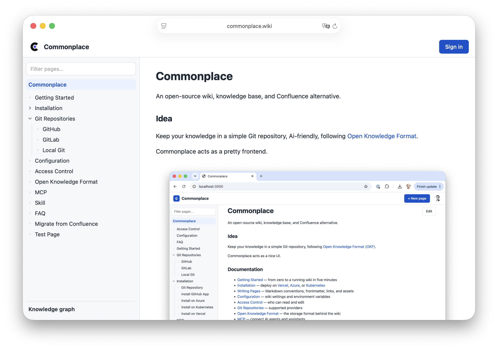

Commonplace is an open-source wiki, knowledge base and Confluence alternative, based on a Git repository following [Open Knowledge Format](https://github.com/GoogleCloudPlatform/knowledge-catalog/blob/main/okf/SPEC.md), with a nice UI.

Documentation: [commonplace.wiki](https://www.commonplace.wiki) (itself a Commonplace wiki for its [knowledgebase](https://github.com/commonplace-wiki/knowledgebase))




## Features

- **Beautiful UI**: A familiar look and feel, but less bloated.
- **Just a frontend**: Commonplace is a stateless frontend. Everything is persisted in your Git repository.
- **GitHub and GitLab**: Works with repositories on github.com, gitlab.com, or a self-hosted GitLab. The provider's login and permission model controls who has read and write access to the wiki. Support for public and private repos.
- **Open Knowledge Format**: Google's universal format to collect knowledge and relationships.
- **Markdown Editor**: A nice editor with just the right feature set. Good support for code snippets, drag & drop, screenshots and rich formatting.
- **Knowledge Graph**: An interactive graph of all pages, connected by the links between them and the folder structure.
- **AI friendly**: The MCP server `/api/mcp` lets AI agents search, read, and write wiki pages and relationships to serve as the business knowledge for your agents. See the [MCP docs](https://www.commonplace.wiki/mcp.md). Or just point your agent to the Git repo.
- **Confluence Migration Skill**: Ask your coding agent to run the [confluence-to-commonplace skill](.claude/skills/confluence-to-commonplace/SKILL.md) to migrate a Confluence space to Commonplace.

## Try locally

The fastest way to try Commonplace with a local Git repository:

```bash
git_repo=$(mktemp -d) && git init -q "$git_repo" && echo "Created Git repository: $git_repo"
docker run -p 3000:3000 \
  -v "$git_repo":/repo -e GIT_REPO=/repo \
  commonplacewiki/commonplace
```

Open http://localhost:3000.

## Quickstart

In production, the knowledge lives in a private or public GitHub or GitLab repository.

You need to set up a [GitHub App](https://www.commonplace.wiki/Installation/github-app.md) or [GitLab OAuth App](https://www.commonplace.wiki/Git-Repositories/gitlab.md) to pull the repo and to authenticate users. You can use the [https://commonplace.wiki/setup](https://www.commonplace.wiki/setup) which guides you to the setup.

```bash
docker run -p 3000:3000 \
  -e GIT_REPO=https://github.com/owner/repo \
  -e GITHUB_CLIENT_ID=... \
  -e GITHUB_CLIENT_SECRET=... \
  -e SESSION_SECRET=$(openssl rand -hex 32) \
  commonplacewiki/commonplace
```

If the repository is public, the wiki is readable without signing in. Reading a private repository and editing pages require it.

Refer to the [documentation](https://www.commonplace.wiki) for all config options. For GitLab wikis (gitlab.com or self-hosted), see the [GitLab guide](https://www.commonplace.wiki/Git-Repositories/gitlab.md). Additional installation methods, such as [Kubernetes](https://www.commonplace.wiki/Installation/install-on-kubernetes.md), [Azure](https://www.commonplace.wiki/Installation/install-on-azure.md), and [Vercel](https://www.commonplace.wiki/Installation/install-on-vercel.md), are covered in the [Installation docs](https://www.commonplace.wiki/Installation).

## Local Setup (from source)

```bash
cp .env.example .env.local   # set at least GIT_REPO
npm install
npm run dev
```

Open http://localhost:3000 and sign in. 

## Read more

https://www.commonplace.wiki/
